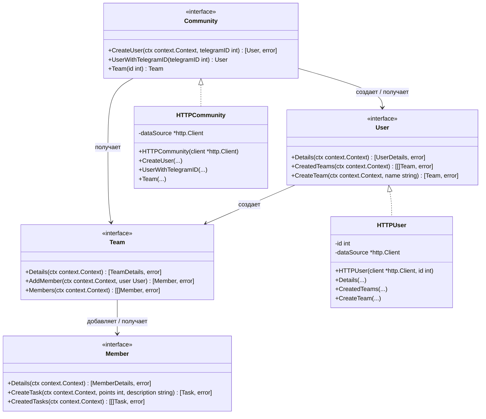
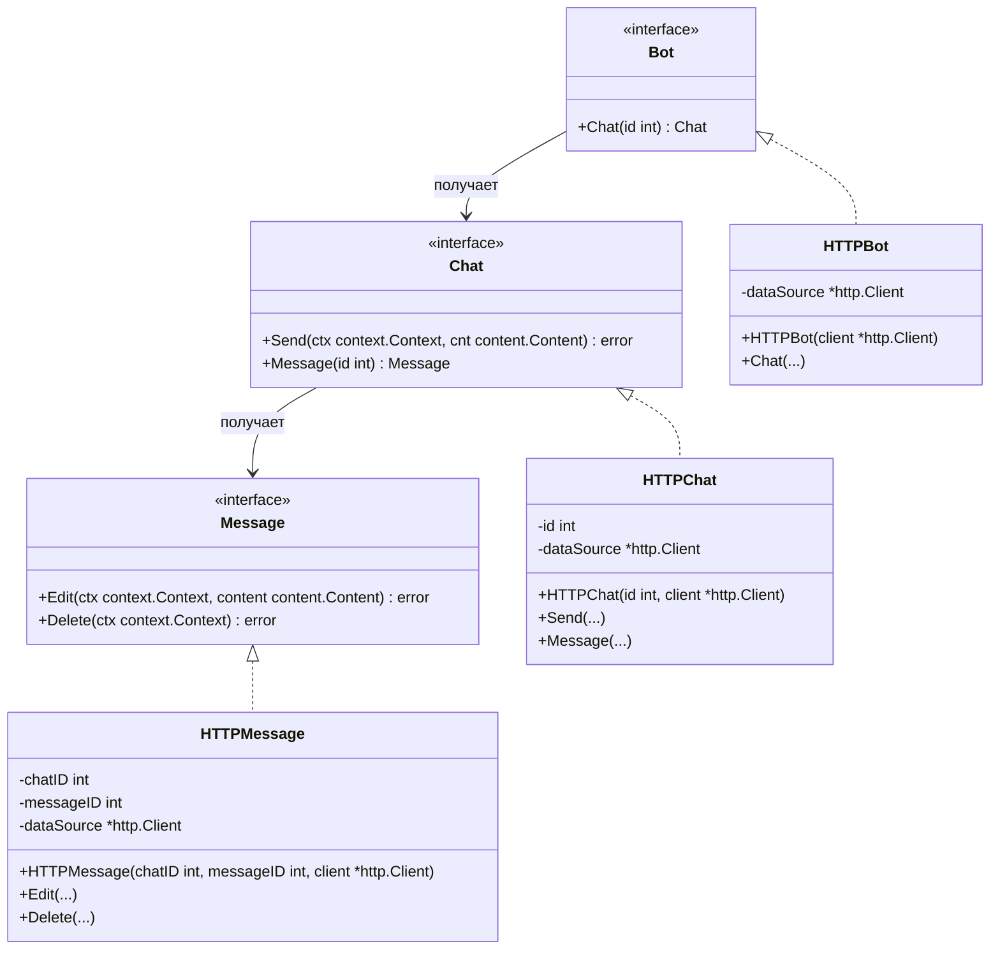
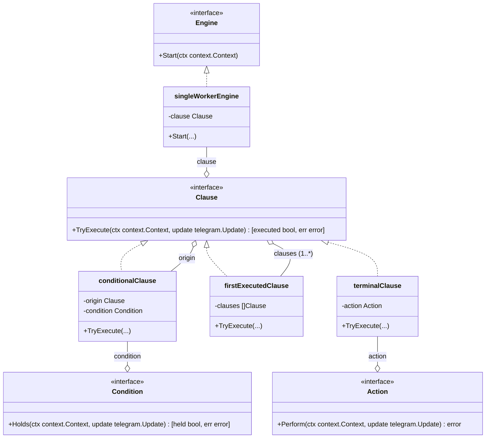
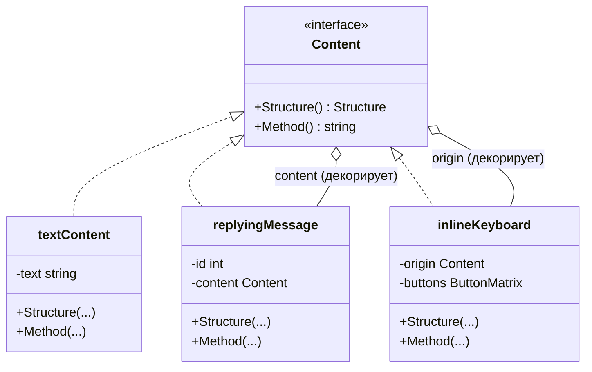

# Bot Modules Class Diagrams

## Domain

```mermaid
classDiagram
    direction TB

    class Community {
        <<interface>>
        +CreateUser(ctx context.Context, telegramID int) [User, error]
        +UserWithTelegramID(telegramID int) User
        +Team(id int) Team
    }

    class User {
        <<interface>>
        +Details(ctx context.Context) [UserDetails, error]
        +CreatedTeams(ctx context.Context) [[]Team, error]
        +CreateTeam(ctx context.Context, name string) [Team, error]
    }

    class Team {
        <<interface>>
        +Details(ctx context.Context) [TeamDetails, error]
        +AddMember(ctx context.Context, user User) [Member, error]
        +Members(ctx context.Context) [[]Member, error]
    }

    class Member {
        <<interface>>
        +Details(ctx context.Context) [MemberDetails, error]
        +CreateTask(ctx context.Context, points int, description string) [Task, error]
        +CreatedTasks(ctx context.Context) [[]Task, error]
    }

%% http
    class HTTPCommunity {
        -dataSource *http.Client
        +HTTPCommunity(client *http.Client)
        +CreateUser(...)
        +UserWithTelegramID(...)
        +Team(...)
    }
    class HTTPUser {
        -id int
        -dataSource *http.Client
        +HTTPUser(client *http.Client, id int)
        +Details(...)
        +CreatedTeams(...)
        +CreateTeam(...)
    }

%% Отношения (связи):

%% Community создает или возвращает User и Team
    Community --> Team: получает
    Community --> User: создает / получает
%% User создает Team
    User --> Team: создает
%% Team возвращает Member
    Team --> Member: добавляет / получает
%% 
    User <|.. HTTPUser
    Community <|.. HTTPCommunity
```

## Telegram

```mermaid
classDiagram
    direction TB

    class Bot {
        <<interface>>
        +Chat(id int) Chat
    }

    class Chat {
        <<interface>>
        +Send(ctx context.Context, cnt content.Content) error
        +Message(id int) Message
    }

    class Message {
        <<interface>>
        +Edit(ctx context.Context, content content.Content) error
        +Delete(ctx context.Context) error
    }
%% http

    class HTTPBot {
        -dataSource *http.Client
        +HTTPBot(client *http.Client)
        +Chat(...)
    }
    class HTTPChat {
        -id int
        -dataSource *http.Client
        +HTTPChat(id int, client *http.Client)
        +Send(...)
        +Message(...)
    }
    class HTTPMessage {
        -chatID int
        -messageID int
        -dataSource *http.Client
        +HTTPMessage(chatID int, messageID int, client *http.Client)
        +Edit(...)
        +Delete(...)
    }
%% Отношения (связи):

%% Bot создает/получает Chat (Ассоциация/Фабрика)
    Bot --> Chat: получает
%% Chat создает/получает Message (Ассоциация/Фабрика)
    Chat --> Message: получает
    Bot <|.. HTTPBot
    Chat <|.. HTTPChat
    Message <|.. HTTPMessage
```

## Processing

```mermaid
classDiagram
    direction TB

    class Action {
        <<interface>>
        +Perform(ctx context.Context, update telegram.Update) error
    }

    class Clause {
        <<interface>>
        +TryExecute(ctx context.Context, update telegram.Update) [executed bool, err error]
    }

    class Condition {
        <<interface>>
        +Holds(ctx context.Context, update telegram.Update) [held bool, err error]
    }

    class Engine {
        <<interface>>
        +Start(ctx context.Context)
    }

%% Структуры Реализации
    class conditionalClause {
        -origin Clause
        -condition Condition
        +TryExecute(...)
    }

    class firstExecutedClause {
        -clauses []Clause
        +TryExecute(...)
    }

    class terminalClause {
        -action Action
        +TryExecute(...)
    }

    class singleWorkerEngine {
        -clause Clause
        +Start(...)
    }

%% Реализация интерфейсов
    Clause <|.. conditionalClause
    Clause <|.. firstExecutedClause
    Clause <|.. terminalClause
    Engine <|.. singleWorkerEngine
%% Отношения Зависимости/Композиции

%% conditionalClause содержит Clause и Condition
    conditionalClause --o Clause: origin
    conditionalClause --o Condition: condition
%% firstExecutedClause содержит список Clause
    firstExecutedClause --o Clause: clauses (1..*)
%% terminalClause содержит Action
    terminalClause --o Action: action
%% Engine использует корневой Clause
    singleWorkerEngine --o Clause: clause
```

## Content

```mermaid
classDiagram
    direction TB

    class Content {
        <<interface>>
        +Structure() Structure
        +Method() string
    }

%% Базовая реализация
    class textContent {
        -text string
        +Structure(...)
        +Method(...)
    }

%% Декораторы
    class replyingMessage {
        -id int
        -content Content
        +Structure(...)
        +Method(...)
    }

    class inlineKeyboard {
        -origin Content
        -buttons ButtonMatrix
        +Structure(...)
        +Method(...)
    }

%% Реализация интерфейсов
    Content <|.. textContent
    Content <|.. replyingMessage
    Content <|.. inlineKeyboard
%% Отношения Декоратора/Композиции

%% replyingMessage декорирует другой Content
    replyingMessage --o Content: content (декорирует)
%% inlineKeyboard декорирует другой Content
    inlineKeyboard --o Content: origin (декорирует)
```