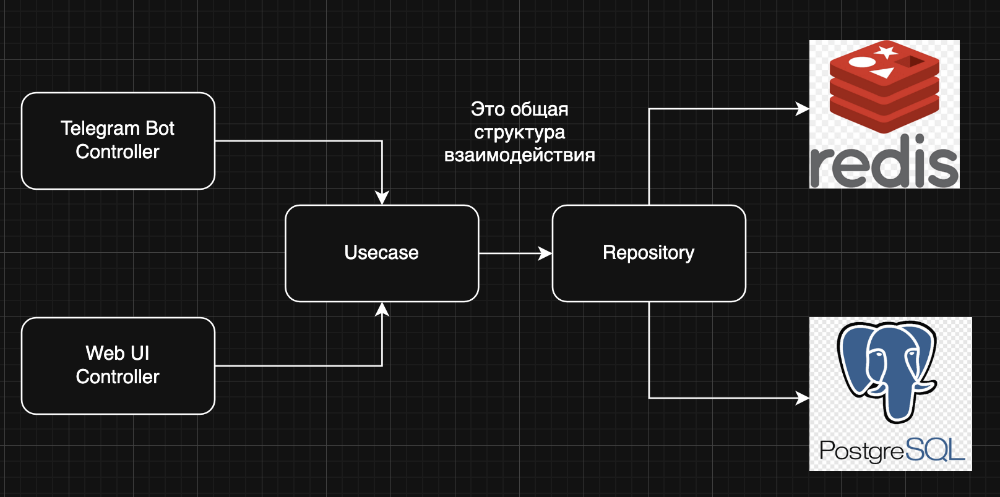
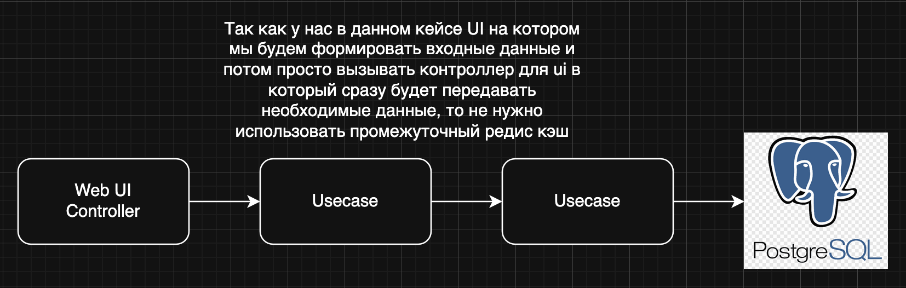
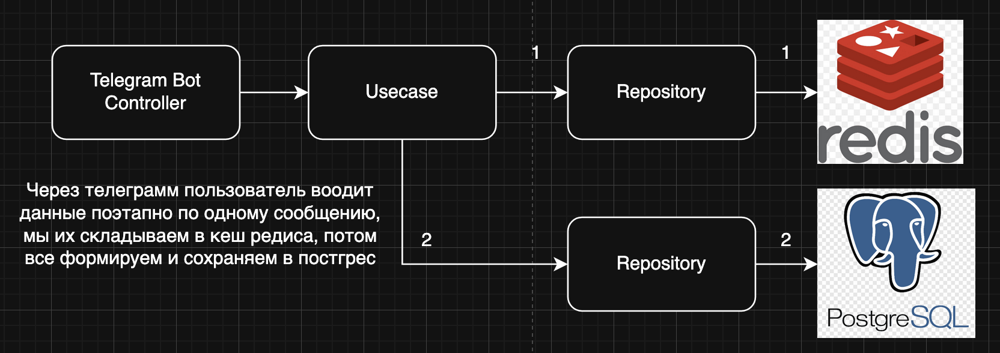

# Концепция проекта

* [1. Глоссарий](#1-глоссарий)
* [2. Необходимость проекта](#2-необходимость-проекта)
    * [2.1. Обоснование необходимости](#21-обоснование-необходимости)
    * [2.2. Видение проекта](#22-видение-проекта)
    * [2.3. Анализ выгод](#23-анализ-выгод)
* [3. Концепция решения](#3-концепция-решения)
    * [3.1. Цели и задачи](#31-цели-и-задачи)
    * [3.2. Предположения и ограничения](#32-предположения-и-ограничения)
* [4. Анализ использования](#4-анализ-использования)
    * [4.1. Пользователи](#41-пользователи)
    * [4.2. Сценарии использования](#42-сценарии-использования)
* [5. Требования](#5-требования)
    * [5.1. Требования пользователей](#51-требования-пользователей)
    * [5.2. Системные требования](#52-системные-требования)
* [6. Рамки](#6-рамки)
    * [6.1. Функциональность решения](#61-функциональность-решения)
    * [6.2. За рамками решения](#62-за-рамками-решения)
    * [6.3. Критерии одобрения решения](#63-критерии-одобрения-решения)
* [7. Стратегии дизайна решения](#7-стратегии-дизайна-решения)
    * [7.1. Стратегия архитектурного дизайна](#71-стратегия-архитектурного-дизайна)
        * [7.1.1. Общая архитектура решения](#711-общая-архитектура-решения)
        * [7.1.2. Ключевые компоненты](#712-ключевые-компоненты)
        * [7.1.3. Принципы проектирования](#713-принципы-проектирования)
        * [7.1.4. Преимущества выбранной архитектуры](#714-преимущества-выбранной-архитектуры)
    * [7.2. Стратегия технологического дизайна](#72-стратегия-технологического-дизайна)
        * [7.2.1. Технологический стек Frontend](#721-технологический-стек-frontend)
        * [7.2.2. Технологический стек Backend](#722-технологический-стек-backend)

## 1. Глоссарий

**Задача** — базовая единица работы в системе, имеющая определённый вес в баллах и описание необходимых действий.

**Команда** — группа пользователей, которые совместно используют систему Coopera для распределения и учета выполнения
задач.

**Менеджер** — пользователь с расширенными правами, который может создавать команду, задачи, а также
разрешает спорные ситуации.

**Участник команды** — пользователь, который может создавать и выполнять задачи.

**Баллы** — единицы измерения вклада участников, начисляемые за выполнение задач в соответствии с их весом.

## 2. Необходимость проекта

### 2.1. Обоснование необходимости

В небольших командах (студенческие группы, соседи по квартире, волонтерские организации) часто возникают конфликты из-за
неравномерного распределения рутинных задач. Некоторые участники активно берут на себя обязанности, другие избегают
работы.

Проект направлен на разрешение следующих проблем:

1. **Отсутствие прозрачной системы учета вклада** каждого участника команды, что не позволяет объективно оценивать вклад
   каждого члена коллектива.

2. **Хаотичное или субъективное распределение задач**, что усложняет планирование и снижает эффективность работы
   команды.

3. **Отсутствие общей картины загруженности**, из-за чего участники не видят, кто и сколько задач выполняет.

4. **Возникновение конфликтов и демотивации** активных участников, которые чувствуют несправедливость в распределении
   обязанностей.

5. **Высокая административная нагрузка на менеджера команды**, которому приходится тратить значительное время на
   распределение и контроль выполнения задач.

### 2.2. Видение проекта

Coopera станет доступным и простым решением для автоматизации распределения рутинных задач в малых группах, обеспечивая
прозрачность вклада каждого участника и снижая конфликты внутри команд к концу 2025 года.

### 2.3. Анализ выгод

Заинтересованные стороны получат следующие выгоды по завершении проекта:

**Для менеджеров команд**

* Автоматизация процесса распределения рутинных задач
* Прозрачная система для разрешения споров
* Статистика выполненных задач команды

**Для участников команд**

* Оптимальное распределение задач и признание вклада каждого
* Прозрачная система учета выполненных обязанностей
* Возможность влиять на процесс распределения задач
* Снижение конфликтов из-за неравномерной нагрузки

**Для всей команды в целом**

* Повышение равномерности распределения нагрузки
* Сокращение конфликтов из-за распределения обязанностей
* Увеличение прозрачности — все участники имеют доступ к статистике
* Геймификация рутинных задач, повышающая мотивацию

**Для команды разработчиков**

* Получение опыта командной работы над реальным проектом полного цикла (от концепции до внедрения)
* Отработка практических навыков в современных технологиях
* Развитие компетенций в проектировании архитектуры, интеграции систем и управлении продуктом
* Возможность дальнейшего развития проекта как стартапа или учебной платформы

## 3. Концепция решения

### 3.1. Цели и задачи

**Цель 1: Создать прозрачную систему учета вклада каждого участника**

* Задача 1.1: Разработать механизм подсчета баллов и рейтингов в реальном времени
* Задача 1.2: Добавить возможность просмотра статистики и истории создания/выполнения задач

**Цель 2: Минимизировать конфликты из-за распределения обязанностей**

* Задача 2.1: Реализовать механизм создания задач с определением их веса в баллах

**Цель 3: Обеспечить оптимальное распределение задач между участниками команды**

* Задача 3.1: Разработать алгоритм автоматического распределения задач с учетом текущей загруженности и баланса баллов
* Задача 3.2: Добавить возможность самостоятельно брать задачи из общего списка

**Цель 4: Создать интуитивно понятный и удобный интерфейс взаимодействия с системой**

* Задача 4.1: Разработать простой и понятный пользовательский интерфейс Telegram-бота  
* Задача 4.2: Обеспечить минимальное количество действий для создания, принятия и завершения задач  
* Задача 4.3: Реализовать наглядное отображение статусов задач, баллов и рейтингов участников  

### 3.2. Предположения и ограничения

**Предположения**

1. Участники команды имеют доступ к смартфону/компьютеру и базовые навыки работы с приложениями.
2. Команды имеют стабильный состав на период использования системы (минимум месяц).
3. Участники согласны использовать систему и следовать ее правилам.
4. В командах есть общие цели и минимальный уровень доверия между участниками.
5. Большинство задач, распределяемых в системе, не требуют специальных навыков или экспертизы.

**Ограничения**

1. **Размер команды:** Система эффективно работает для команд от 3 до 12 участников (оптимально 5-8).
2. **Тип задач:** Система подходит только для простых, регулярно повторяющихся задач с четко определяемым результатом.
3. **Технические ограничения:** Необходимо стабильное интернет-соединение для полноценной работы приложения.
4. **Типы решаемых проблем:** Система не решает стратегические задачи развития команды.

## 4. Анализ использования

### 4.1. Пользователи

1. **Менеджеры команд** — координаторы, создающие команды, задачи, и добавляющие участников и разрешающие споры:
    * Старосты студенческих групп
    * Координаторы волонтерских организаций
    * Ответственные за офисное пространство
    * Главы домохозяйств или старшие в квартире с соседями

2. **Участники команды** — члены команды, создающие и выполняющие задач:
    * Студенты
    * Волонтеры
    * Сотрудники организации
    * Соседи/члены семьи

### 4.2. Сценарии использования

**Сценарий 1: Создание команды и настройка системы**

1. Менеджер регистрируется в системе
2. Создает новую команду
3. Добавляет участников в команду
4. Создает задачи и указывает их вес в баллах

**Сценарий 2: Создание и распределение задач**

1. Участник/Менеджер создает задачу
2. Задача публикуется в общем списке
3. Участники могут самостоятельно брать задачи, но только после указание ее веса в баллах менеджером
4. Если задача не взята до дедлайна, система автоматически назначает ее

**Сценарий 3: Выполнение и закрытие задачи**

1. Участник принимает задачу в работу
2. Статус задачи изменяется на "В работе"
3. После выполнения задачи, участник/менеджер изменяют статус задачи на "На проверке"
4. Менеджер проверяет правильность выполнения задачи
5. Задача переводится в статус "Выполнена"
6. Система начисляет баллы участнику

**Сценарий 4: Автоматическое распределение задач системой**

1. Менеджер включает режим автоматического распределения
2. Система анализирует загруженность участников и их текущий баланс баллов
3. Задача автоматически назначается наиболее подходящему участнику

**Сценарий 5: Работа с системой через Telegram-бот**

1. Пользователь выполняет основные действия через Telegram-бот
2. Быстро просматривает текущие задачи, участников команды, статистики

**UML-диаграмма системы Coopera**

* в процессе...

## 5. Требования

### 5.1. Требования пользователей

1. **Простота использования**
    * Интуитивно понятный интерфейс без необходимости обучения
    * Минимальное количество шагов для выполнения основных операций
    * Адаптивный дизайн для использования на разных устройствах

2. **Функциональность для менеджера команды**
    * Возможность создания команды и добавления участников
    * Возможность создания задач и определение их веса в баллах
    * Настройка задач с определением веса в баллах
    * Доступ к статистике выполненных задач команды

3. **Функциональность для участников**
    * Возможность создания задач, без определения из веса в баллах
    * Механизм для самостоятельного выбора задач из общего списка
    * Доступ к статистике — выполненные задачи, количество баллов

4. **Автоматические функции**
    * Распределение невзятых задач на основе алгоритма
    * Подсчет баллов в реальном времени
    * Доступ к истории операций для аудита

5. **Прозрачность и коммуникация**
    * Все участники должны видеть задачи, баллы и статистику
    * Возможность обсуждения задач и результатов

### 5.2. Системные требования

1. **Производительность**
    * Время отклика интерфейса — не более 2 секунд для всех операций
    * Поддержка одновременной работы до 12 участников в одной команде
    * Обработка до 500 задач на команду в месяц
    * Отправка уведомлений в течение 30 секунд с момента события

2. **Безопасность и конфиденциальность**
    * Авторизация через Telegram для веб-приложения и бота
    * Разграничение прав доступа на уровне ролей (менеджер/участник)
    * Изоляция данных разных команд — участники видят только информацию своей команды
    * Сохранение полной истории всех операций для аудита и прозрачности

3. **Доступность и надёжность**
    * Доступность системы не менее 99.5% времени
    * Ежедневное автоматическое резервное копирование данных
    * Восстановление после сбоя без потери пользовательских данных

4. **Совместимость**
    * Веб-приложение: доступ через браузер с любого устройства (десктоп, планшет, смартфон)
    * Telegram-бот: работа на всех платформах, поддерживающих Telegram
    * Адаптивный дизайн для корректного отображения на экранах до 4K
    * Поддержка популярных браузеров: Chrome, Firefox, Safari, Edge (последние 2 версии)

## 6. Рамки

### 6.1. Функциональность решения

1. **Управление командой**
    * Создание команды и приглашение участников
    * Настройка задач с определением веса в баллах
    * Система ролей (менеджер, участник) с различными уровнями доступа

2. **Управление задачами**
    * Создание задач на выполнение задач для команды
    * Самостоятельный выбор задач из общего списка
    * Автоматическое распределение невзятых задач

3. **Учет и статистика**
    * Подсчет баллов и выполненных задач в реальном времени
    * Просмотр личной статистики и истории выполнения
    * История всех операций для аудита

4. **Коммуникации и уведомления**
    * Оповещения о новых задачах и дедлайнах
    * Сообщения о назначении или переназначении задач
    * Информирование о получении баллов и изменении рейтинга

5. **Доступ через два интерфейса**
    * Веб-приложение с авторизацией через Telegram
    * Telegram-бот для быстрого доступа к основным функциям

### 6.2. За рамками решения

1. **Сложные проектные задачи**
    * Система не предназначена для управления проектами с взаимосвязанными задачами
    * Не поддерживается планирование и отслеживание многоэтапных задач
    * Отсутствуют инструменты для декомпозиции сложных задач
      (Причина: фокус на простых рутинных задачах для большей эффективности)

2. **Финансовый учет и вознаграждения**
    * Отсутствует интеграция с финансовыми системами
    * Нет функционала денежных расчетов между участниками
    * Система не занимается учетом затраченных на задачи средств
      (Причина: соблюдение требований простоты и безопасности)

3. **Продвинутые инструменты коммуникации**
    * Отсутствуют чаты и групповые обсуждения
    * Нет видео-конференций и аудио-связи
    * Не предусмотрены расширенные инструменты командной работы
      (Причина: фокус на основной функциональности и интеграция с существующими решениями)

4. **Психологическая диагностика и развитие команды**
    * Система не занимается оценкой психологического климата в команде
    * Отсутствуют инструменты для личностного роста
    * Нет функционала для командообразования и развития soft skills
      (Причина: выход за пределы основной цели системы)

5. **Интеграция с внешними системами управления задачами**
    * Отсутствует синхронизация с Jira, Trello, Asana и другими системами
    * Нет API для взаимодействия с корпоративными системами
      (Причина: сохранение простоты и самодостаточности решения на начальном этапе)

### 6.3. Критерии одобрения решения

Критерии одобрения определяют, когда система Coopera считается готовой к использованию. Оценка проводится по ключевым
аспектам работы и удобства для пользователей.

| Категория                         | Что оценивается                                     | Метрика / Условие                                                                                                    | Почему важно                                        |
|-----------------------------------|-----------------------------------------------------|----------------------------------------------------------------------------------------------------------------------|-----------------------------------------------------|
| Эффективность распределения задач | Автоматизация распределения и нагрузки на менеджера | ≥50% Задачи  распределяются автоматически без ручного вмешательства при долгом нахождении в бэклоге | Снижает конфликты и облегчает работу менеджера      |
| Удовлетворенность пользователей   | Интерфейс и работа системы                          | ≥75% пользователей оценивают интерфейс как интуитивный понятный и довольны работой системы           | Повышает мотивацию и вовлечённость                  |
| Функциональная полнота            | Основные функции                                    | Все ключевые функции реализованы и работают корректно (создание задач, переключение статуса задач, назначение пользователей на задачу, создание команд, учет баллов, вход в систему по UserName Telegram) | Обеспечивает полноценное использование системы      |
| Техническая надежность            | Стабильность и доступность                          | Система работает стабильно, интерфейс откликается быстро, критических ошибок нет                                     | Пользователи могут работать без задержек и сбоев    |
| Безопасность и прозрачность       | Доступ и контроль                                   | Пользователи имеют доступ к своей статистике                   | Гарантирует доверие к системе и прозрачность работы |

## 7. Стратегии дизайна решения

### 7.1. Стратегия архитектурного дизайна

#### 7.1.1. Общая архитектура решения

Решение построено по принципу **чистой архитектуры (Clean Architecture)** с четким разделением на слои, что обеспечивает
гибкость, тестируемость и легкость поддержки.

#### 7.1.2. Ключевые компоненты

1. **Domain Layer (Слой предметной области)**
    * **Роль:** Содержит ядро бизнес-логики, независимое от внешних технологий

    * **Компоненты:**
        * **Сущности (Entities)** - бизнес-объекты (User, Order, Session)
        * **Сценарии использования (Use Cases)** - бизнес-правила и процессы
        * **Интерфейсы репозиториев** - контракты для доступа к данным

    * **Преимущества:**
        * Не зависит от фреймворков и баз данных
        * Легко тестируется (unit-тесты)
        * Стабилен при изменениях инфраструктуры

2. **Data Layer (Слой данных)**
    * **Роль:** Реализация механизмов работы с данными

    * **Компоненты:**
        * **Postgres Repository** - основное хранилище данных
        * **Реализации репозиториев** - конкретные реализации интерфейсов из Domain Layer

    * **Принцип работы:** Слой зависит от Domain Layer (инверсия зависимостей)

3. **Delivery Layer (Слой доставки)**
    * **Роль:** Обеспечивает взаимодействие с внешним миром

    * **Компоненты:**
        * **Telegram Bot Controller** - обработка взаимодействия через Telegram бота
        * **Web UI Controller** - обработка HTTP запросов веб-интерфейса

    * **Принцип работы:** Контроллеры принимают внешние запросы и делегируют выполнение Use Cases из Domain Layer

#### 7.1.3. Принципы проектирования

1. **Dependency Inversion**
    * Зависимости направлены внутрь, к ядру системы
    * Внешние слои зависят от абстракций Domain Layer
    * Легкая замена компонентов без изменения бизнес-логики

2. **Single Responsibility**
    * Каждый компонент отвечает за одну зону ответственности
    * Use Cases - за бизнес-правила
    * Репозитории - за доступ к данным
    * Контроллеры - за обработку внешних запросов

3. **Interface Segregation**
    * Четкие интерфейсы между слоями
    * Domain Layer определяет контракты для Data Layer
    * Минимальные и специфичные интерфейсы

4. **Separation of Concerns**
    * Разделение обработки разных типов взаимодействий
    * Изолированная бизнес-логика
    * Независимое развитие компонентов

#### 7.1.4. Преимущества выбранной архитектуры

1. **Гибкость**
    * Легко добавить новые каналы взаимодействия (API, мобильное приложение)
    * Быстрая адаптация к изменениям требований
    * Простая интеграция новых технологий

2. **Тестируемость**
    * Бизнес-логика изолирована от внешних зависимостей
    * Возможность написания unit-тестов для Use Cases
    * Mock-реализации репозиториев для тестирования

3. **Масштабируемость**
    * Возможность масштабировать отдельные компоненты
    * Независимое развертывание слоев
    * Горизонтальное масштабирование при необходимости

4. **Поддерживаемость**
    * Четкие границы ответственности
    * Легкость понимания кодовой базы
    * Упрощенный онбординг новых разработчиков
    * Снижение стоимости долгосрочной поддержки

### 7.2. Стратегия технологического дизайна

Разработка программного комплекса, включающего веб-приложение и Telegram-бота, требует использования определенных
продуктов и технологий. Данная стратегия описывает, какие технологии и продукты выбраны нашей группой в качестве
средства реализации решения, и обосновывает их выбор.

**Основные критерии выбора:**

* **Производительность и современность:** Использование современных, высокопроизводительных инструментов.
* **Масштабируемость:** Возможность эффективно развивать кодовую базу по мере роста функциональности приложения.
* **Сообщество и экосистема:** Наличие широкого сообщества, качественной документации и богатой экосистемы пакетов.
* **Type Safety:** Использование статической типизации для повышения надежности и поддерживаемости кода.
* **Опыт команды:** Учет текущих компетенций разработчиков для минимизации времени на освоение.
* **Интегрируемость:** Способность различных компонентов системы эффективно взаимодействовать между собой.

#### 7.2.1. Технологический стек Frontend

| Технология            | Обоснование выбора                                                                                                                                                                                                                                                                                                                                                                  |
|-----------------------|-------------------------------------------------------------------------------------------------------------------------------------------------------------------------------------------------------------------------------------------------------------------------------------------------------------------------------------------------------------------------------------|
| **React**             | React является промышленным стандартом для построения пользовательских интерфейсов. Компонентный подход обеспечивает создание переиспользуемых `UI-компонентов`, что способствует упрощению разработки и поддержки сложных интерфейсов. `Virtual DOM` гарантирует высокую производительность рендеринга, а развитая экосистема предоставляет решения для большинства типовых задач. |
| **TypeScript**        | Применение `TypeScript` обеспечивает статическую типизацию, что позволяет выявлять ошибки на этапе компиляции. Это повышает надежность кода, выполняет функцию документации и упрощает рефакторинг.                                                                                                                                                                                 |
| **Vite**              | Инструмент выбран благодаря превосходной производительности в сравнении с `Create React App`. Использование нативных `ES-модулей` обеспечивает мгновенный запуск сервера разработки и эффективную горячую перезагрузку модулей. Production-сборка на основе `Rollup` гарантирует оптимизированный результат, а минимальная конфигурация сокращает время начала работы над проектом. |
| **Tailwind CSS**      | Фреймворк реализует `utility-first подход`, обеспечивая быстрое создание интерфейсов непосредственно в разметке компонентов (`TSX`/`JSX`). Это сокращает количество контекстных переключений между файлами и обеспечивает согласованность дизайна.                                                                                                                                  |
| **ESLint / Prettier** | Комбинация инструментов обеспечивает соблюдение стандартов кодирования и автоматическое форматирование. `ESLint` выполняет статический анализ для выявления проблем, а `Prettier` гарантирует единообразие стиля кода.                                                                                                                                                              |

#### 7.2.2. Технологический стек Backend

| Технология         | Обоснование выбора                                                                                                                                                                                                                                                                                             |
|--------------------|----------------------------------------------------------------------------------------------------------------------------------------------------------------------------------------------------------------------------------------------------------------------------------------------------------------|
| **Go**             | Компилируемый язык с высокой производительностью и низким потреблением ресурсов; удобная модель конкурентности (goroutines/channels) и обширная стандартная библиотека для сетевых сервисов упрощают реализацию API и логики Telegram‑бота. Статическая типизация и единый бинарник упрощают отладку и деплой. |
| **Docker**         | Контейнеризация обеспечивает повторяемость окружения, изоляцию зависимостей и переносимость образов между разработкой и продакшеном; упрощает упаковку сервисов и их развёртывание.                                                                                                                            |
| **Docker Compose** | Инструмент для быстрой локальной оркестрации сервисов (API, PostgreSQL и т.д.), удобен для разработки и интеграционного тестирования, позволяет запускать всю стек‑среду одной командой.                                                                                                                |
| **PostgreSQL**     | Надёжная реляционная СУБД для транзакционной логики (команды, баллы, задачи). Поддержка сложных запросов и индексов делает её гибкой для хранения как структурированных, так и полуструктурированных данных.                                                                                                   |
| **golang‑migrate** | Инструмент версионирования схемы БД, поддерживает SQL‑миграции и безопасное применение/откат миграций, что обеспечивает консистентность структуры БД между окружениями                                                                                                                                         |
| **golangci‑lint**  | Агрегатор линтеров для раннего выявления ошибок и проблем качества кода; может запускать набор проверок и легко интегрируется в процессы разработки и CI.                                                                                                                                                      |
| **go test**        | Стандартный инструмент для модульного тестирования. Интеграционные тесты также выполняются через `go test`, но в окружении с контейнерами (PostgreSQL) для проверки поведения системы в условиях, приближённых к продакшену.                                                                            |
