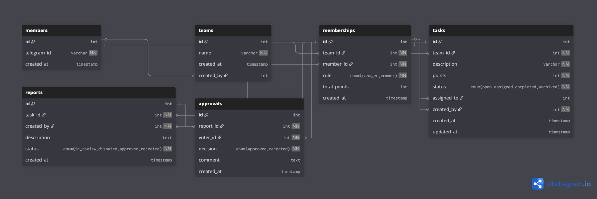

# Схема базы данных

* [1. Визуальная диаграмма](#1-визуальная-диаграмма)
* [2. Сущности](#2-сущности)
* [3. Ключевые проектные решения](#3-ключевые-проектные-решения)
* [4. Исходный код схемы](#4-исходный-код-схемы)

## 1. Визуальная диаграмма

Диаграмма дает общее представление о сущностях и их взаимосвязях.



Диаграмма создана с помощью [dbdiagram.io](https://dbdiagram.io).

Интерактивная версия доступна по [ссылке](https://dbdiagram.io/d/68ee44512e68d21b4161cdb3).

## 2. Сущности

* **`members`** — Пользователи.

* **`teams`** — Команды.

* **`memberships`** — Связывает пользователей (`members`) и команды (`teams`).
  * Уникальность пары (`team_id`, `member_id`) гарантирует, что пользователь не может вступить в одну команду дважды.

* **`tasks`** — Задачи.

* **`reports`** — Отчёты о выполнении задач.
  * Уникальность `task_id` гарантирует, что на одну задачу может быть только один отчет.

* **`approvals`** — Голоса участников за или против отчета.
  * Уникальность пары (`report_id`, `voter_id`) предотвращает повторное голосование.

## 3. Ключевые проектные решения

* **Контекстные внешние ключи команды**: Все операционные внешние ключи (например, `created_by`, `assigned_to`)
  указывают на `memberships.id`, а не на `members.id`. Это строго привязывает каждое действие к пользователю в рамках
  конкретной команды, что важно для целостности данных в среде с несколькими командами.

* **Кэширование баллов**: Поле `memberships.total_points` — это намеренное использование денормализации. Оно кэширует
  баллы пользователя, чтобы избежать дорогостоящих вычислений в реальном времени.

* **Разделенные поля статусов**: Статус задачи (`task`), например `open` или `completed`, отделен от статуса отчета (
  `report`), например `in_review` или `disputed`. Это правильно моделирует две разные машины состояний: одну для
  жизненного цикла задачи и другую для процесса её проверки.

## 4. Исходный код схемы

Полный код схемы на языке DBML.

```dbml
Table members {
  id int [pk, increment]
  telegram_id varchar [unique, not null]
  created_at timestamp [default: `now()`]
}

Table teams {
  id int [pk, increment]
  name varchar [not null]
  created_at timestamp [default: `now()`]
  created_by int [ref: > members.id]
}

Table memberships {
  id int [pk, increment]
  team_id int [ref: > teams.id, not null]
  member_id int [ref: > members.id, not null]
  role enum('manager', 'member') [not null]
  total_points int [default: 0]
  created_at timestamp [default: `now()`]
  indexes {
    (team_id, member_id) [unique]
  }
}

Table tasks {
  id int [pk, increment]
  team_id int [ref: > teams.id, not null]
  description varchar [not null]
  points int [not null]
  status enum('open', 'assigned', 'completed', 'archived') [not null, default: 'open']
  assigned_to int [ref: > memberships.id]
  created_by int [ref: > memberships.id, not null]
  created_at timestamp [default: `now()`]
  updated_at timestamp
}

Table reports {
  id int [pk, increment]
  task_id int [ref: > tasks.id, not null, unique]
  created_by int [ref: > memberships.id, not null]
  description text
  status enum('in_review', 'disputed', 'approved', 'rejected') [not null, default: 'in_review']
  created_at timestamp [default: `now()`]
}

Table approvals {
  id int [pk, increment]
  report_id int [ref: > reports.id, not null]
  voter_id int [ref: > memberships.id, not null]
  decision enum('approved', 'rejected') [not null]
  comment text
  created_at timestamp [default: `now()`]
  indexes {
    (report_id, voter_id) [unique]
  }
}
```
