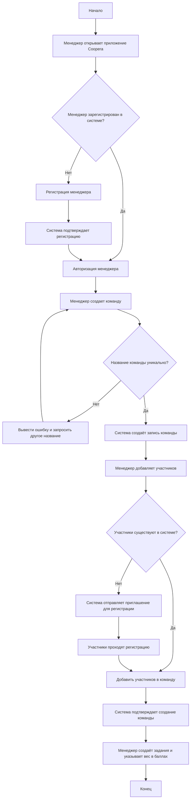
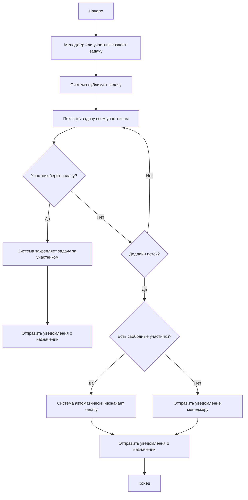
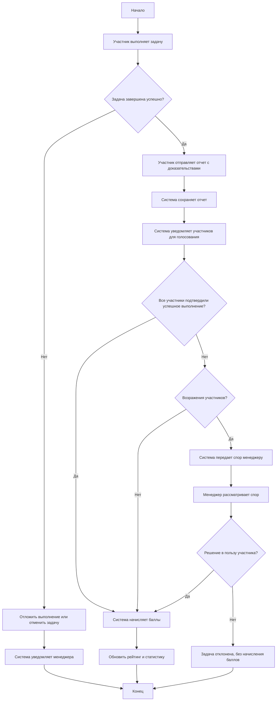
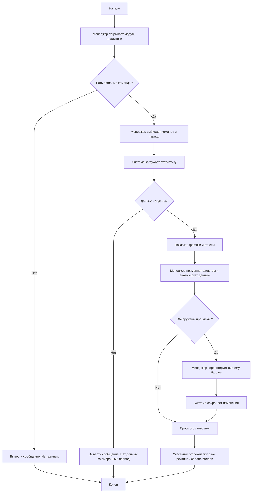
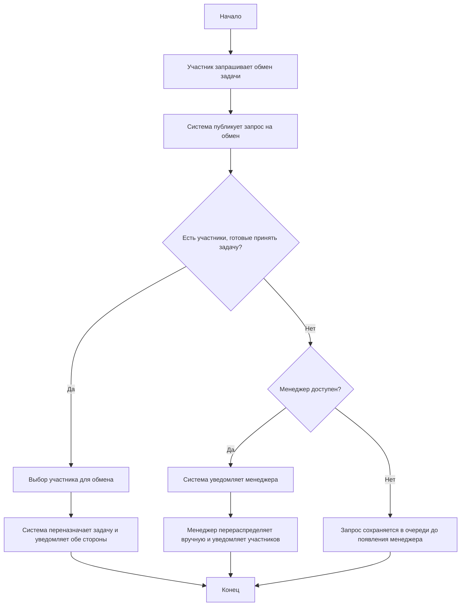

# Функциональная спецификация

* [1. История проекта](#1-история-проекта)
* [2. Цели дизайна](#2-цели-дизайна)
    * [2.1. Требования пользователя](#21-требования-пользователя)
    * [2.2. Системные требования](#22-системные-требования)
    * [2.3. Сценарии использования](#23-сценарии-использования)
* [3. Исключенные возможности и неподдерживаемые сценарии](#3-исключенные-возможности-и-неподдерживаемые-сценарии)
* [4. Предположения и зависимости](#4-предположения-и-зависимости)
* [5. Проект решения](#5-проект-решения)
    * [5.1. Концептуальный проект](#51-концептуальный-проект)
    * [5.2. Логический проект](#52-логический-проект)
    * [5.3. Физический проект](#53-физический-проект)
* [6. Требования к инсталляции и деинсталляции](#6-требования-к-инсталляции-и-деинсталляции)

## 1. История проекта

## 2. Цели дизайна

### 2.1. Требования пользователя

Цели дизайна интерфейса ориентированы на удовлетворение ключевых потребностей пользователей Coopera:

- Простота использования: минимальное количество кликов для выполнения основных действий (создание и обработка задач, просмотр статуса задач).  
- Наглядность интерфейса: удобная визуализация статусов задач, уведомлений и историй взаимодействия.  
- Консистентность: единый стиль компонентов (кнопки, поля ввода, страницы, сайдбар) для всех частей приложения.  
- Мобильная адаптация: интерфейс должен корректно отображаться на планшетах и смартфонах.    
- Доступность: соблюдение базовых принципов доступности для пользователей с ограниченными возможностями.

### 2.2. Системные требования

Дизайн интерфейса учитывает ограничения аппаратного и программного окружения:

- Frontend:
  - Используются компоненты React + TypeScript для унифицированного и модульного дизайна.
  - Создание переиспользуемых компонентов: кнопки, карточки задач, сайдбар, формы, таблицы и панели уведомлений.
  - Поддержка современных браузеров (Chrome, Firefox, Edge, Safari) и адаптивность под мобильные устройства.
- Backend и интеграция:
  - Совместимость с FastAPI и базой данных PostgreSQL.
  - Интерфейс взаимодействует с RESTful API для получения и отправки данных.
- Производительность:
  - Минимизация задержек при загрузке страниц и обновлении данных.
  - Использование оптимизированных компонентов для рендеринга больших списков задач и заявок.
- Безопасность:
  - Аутентификация и авторизация пользователей.
  - Обработка ошибок и защита от некорректного ввода.
- Расширяемость:
  - Возможность добавления новых компонентов и страниц без глобальной переработки интерфейса.
  - Поддержка интеграции с внешними сервисами (Telegram-бот, уведомления, отчёты).

### 2.3. Сценарии использования

**Сценарий 1: Создание команды и настройка системы**
1. Менеджер регистрируется в системе
2. Создает новую команду
3. Добавляет участников в команду
4. Создает задачи и указывает их вес в баллах

**Сценарий 2: Создание и распределение заявок**

1. Участник/Менеджер создает задачу
2. Задача публикуется в общем списке
3. Участники могут самостоятельно брать задачи
4. Если задача не взята до дедлайна, система автоматически назначает ее

**Сценарий 3: Выполнение и подтверждение заявок**

1. Участник выполняет назначенную задачу
2. Создает отчет о выполнении с приложением доказательств
3. Остальные участники получают уведомление о необходимости оценки отчета
4. Участники голосуют за подтверждение/отклонение отчета
5. При единогласном подтверждении задача засчитывается
6. При наличии возражений случай передается на рассмотрение менеджеру

**Сценарий 4: Аналитика и контроль**

1. Менеджер просматривает статистику выполнения задач
2. Анализирует проблемные зоны и тренды
3. Корректирует систему баллов при необходимости
4. Участники отслеживают свой рейтинг и баланс баллов

**Сценарий 5: Обмен задачами**

1. Участник, не имеющий возможности выполнить назначенную задачу, инициирует обмен
2. Другие участники видят запрос на обмен
3. Желающий принять задачу подтверждает обмен
4. Если никто не согласен на обмен, менеджер получает уведомление для ручного перераспределения
5. Система обновляет назначения и уведомляет соответствующих участников

## 3. Исключенные возможности и неподдерживаемые сценарии

## 4. Предположения и зависимости

## 5. Проект решения

### 5.1. Концептуальный проект

### 5.2. Логический проект

### 5.3. Физический проект

## 6. Требования к инсталляции и деинсталляции
