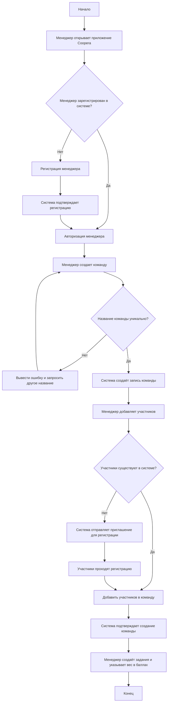
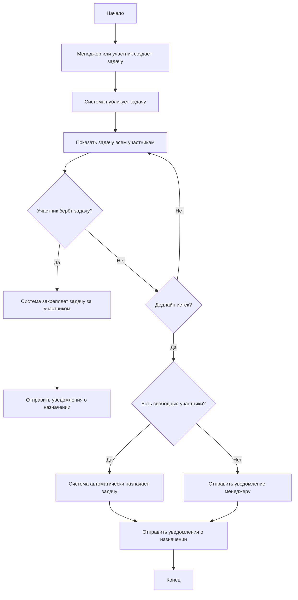
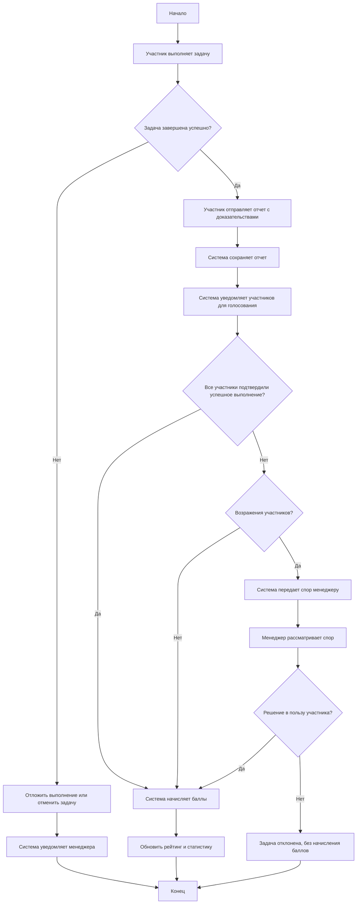
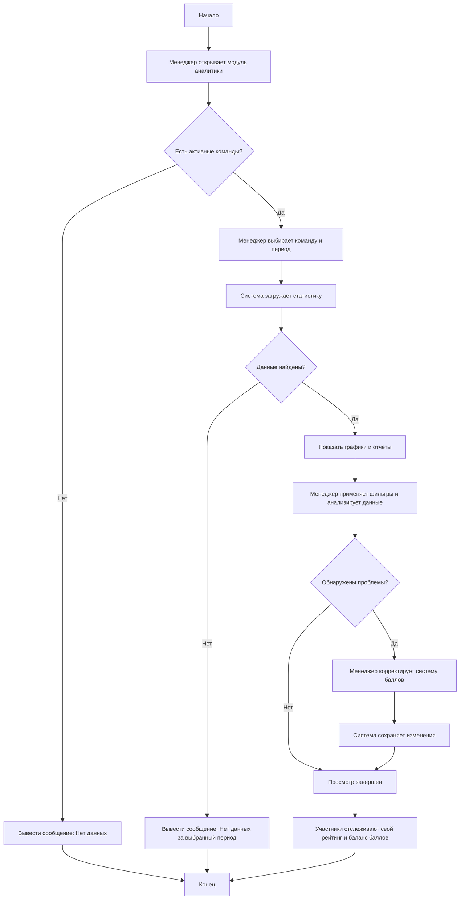
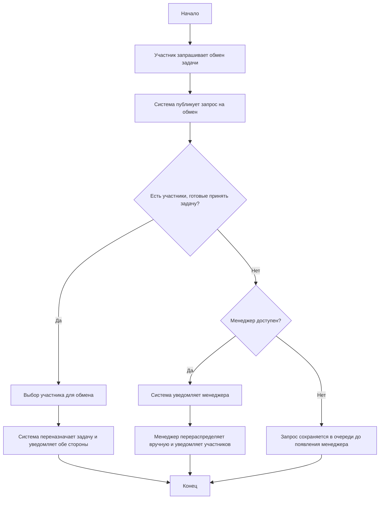

# Функциональная спецификация

* [1. История проекта](#1-история-проекта)
    * [1.1. Сентябрь 2025 (начало) — Формирование команды и организационные решения](#11-сентябрь-2025-начало--формирование-команды-и-организационные-решения)
    * [1.2. Сентябрь 2025 (конец) — Определение основных модулей и требований](#12-сентябрь-2025-конец--определение-основных-модулей-и-требований)
    * [1.3. Октябрь 2025 — Начало разработки и настройка рабочих процессов](#13-октябрь-2025--начало-разработки-и-настройка-рабочих-процессов)
    * [1.4. Итог на конец октября 2025 года](#14-итог-на-конец-октября-2025-года)
* [2. Цели дизайна](#2-цели-дизайна)
    * [2.1. Требования пользователя](#21-требования-пользователя)
    * [2.2. Системные требования](#22-системные-требования)
    * [2.3. Сценарии использования](#23-сценарии-использования)
* [3. Исключенные возможности и неподдерживаемые сценарии](
  #3-исключенные-возможности-и-неподдерживаемые-сценарии)
* [4. Предположения и зависимости](#4-предположения-и-зависимости)
    * [4.1. Предположения](#41-предположения)
    * [4.2. Зависимости](#42-зависимости)
* [5. Проект решения](#5-проект-решения)
    * [5.1. Концептуальный проект](#51-концептуальный-проект)
    * [5.2. Логический проект](#52-логический-проект)
    * [5.3. Физический проект](#53-физический-проект)
* [6. Требования к инсталляции и деинсталляции](
  #6-требования-к-инсталляции-и-деинсталляции)

## 1. История проекта

### 1.1. Сентябрь 2025 (начало) — Формирование команды и организационные решения

На старте проекта команда Coopera проходила этап притирки:

* Распределение ролей
* Выбор капитана группы
* Согласование способов совместной работы

Возникшие конфликты по приоритетам задач и подходам к реализации решались через **компромиссы** и коллективное
обсуждение.

Сформирована структура команды и зоны ответственности: **frontend**, **backend**, **DevOps** и **QA**.

### 1.2. Сентябрь 2025 (конец) — Определение основных модулей и требований

Проведены обсуждения и согласованы ключевые модули проекта:

* Создание и обмен заявками
* Система уведомлений
* Базовый функционал командного взаимодействия

Разработана базовая архитектура системы и взаимодействия между компонентами.

### 1.3. Октябрь 2025 — Начало разработки и настройка рабочих процессов

Настроены инструменты командной работы:

* **GitHub** — контроль версий и управление задачами
* **Telegram** и **Zoom** — коммуникации и синхронизация команды

Созданы базовые ветки репозитория, установлены правила работы через **Pull Request**.

Начата разработка основных функций:

* Регистрация пользователей
* Создание и обработка заявок
* Базовое взаимодействие через Telegram-бота

Проведено первичное тестирование отдельных функций, внесены корректировки в архитектуру.

### 1.4. Итог на конец октября 2025 года

Проект Coopera находится на стадии активной разработки с реализованными базовыми функциями и настроенной
командной работой. На следующих этапах планируется расширение функционала и интеграция модулей.

## 2. Цели дизайна

## 2.1. Требования пользователя

Цели дизайна интерфейса ориентированы на удовлетворение ключевых потребностей пользователей Coopera:

* Простота использования: минимальное количество кликов для выполнения основных действий  
  (создание и обработка задач, просмотр статуса задач).
* Наглядность интерфейса: удобная визуализация статусов задач, уведомлений и историй взаимодействия.
* Консистентность: единый стиль компонентов (кнопки, поля ввода, страницы, сайдбар)  
  для всех частей приложения.
* Мобильная адаптация: интерфейс должен корректно отображаться на планшетах и смартфонах.
* Доступность: соблюдение базовых принципов доступности для пользователей с ограниченными возможностями.

### 2.2. Системные требования

Дизайн интерфейса учитывает ограничения аппаратного и программного окружения:

* **Frontend:**
    * Используются компоненты React + TypeScript для унифицированного и модульного дизайна.
    * Создание переиспользуемых компонентов: кнопки, карточки задач, сайдбар, формы, таблицы  
      и панели уведомлений.
    * Поддержка современных браузеров (Chrome, Firefox, Edge, Safari) и адаптивность  
      под мобильные устройства.
* **Backend и интеграция:**
    * Совместимость с FastAPI и базой данных PostgreSQL.
    * Интерфейс взаимодействует с RESTful API для получения и отправки данных.
* **Производительность:**
    * Минимизация задержек при загрузке страниц и обновлении данных.
    * Использование оптимизированных компонентов для рендеринга больших списков задач и заявок.
* **Безопасность:**
    * Аутентификация и авторизация пользователей.
    * Обработка ошибок и защита от некорректного ввода.
* **Расширяемость:**
    * Возможность добавления новых компонентов и страниц без глобальной переработки интерфейса.
    * Поддержка интеграции с внешними сервисами (Telegram-бот, уведомления, отчёты).

### 2.3. Сценарии использования

**Сценарий 1: Создание команды и настройка системы**

1. Менеджер регистрируется в системе
2. Создает новую команду
3. Добавляет участников в команду
4. Создает задачи и указывает их вес в баллах



**Сценарий 2: Создание и распределение заявок**

1. Участник/Менеджер создает задачу
2. Задача публикуется в общем списке
3. Участники могут самостоятельно брать задачи
4. Если задача не взята до дедлайна, система автоматически назначает ее



**Сценарий 3: Выполнение и подтверждение заявок**

1. Участник выполняет назначенную задачу
2. Создает отчет о выполнении с приложением доказательств
3. Остальные участники получают уведомление о необходимости оценки отчета
4. Участники голосуют за подтверждение/отклонение отчета
5. При единогласном подтверждении задача засчитывается
6. При наличии возражений случай передается на рассмотрение менеджеру



**Сценарий 4: Аналитика и контроль**

1. Менеджер просматривает статистику выполнения задач
2. Анализирует проблемные зоны и тренды
3. Корректирует систему баллов при необходимости
4. Участники отслеживают свой рейтинг и баланс баллов



**Сценарий 5: Обмен задачами**

1. Участник, не имеющий возможности выполнить назначенную задачу, инициирует обмен
2. Другие участники видят запрос на обмен
3. Желающий принять задачу подтверждает обмен
4. Если никто не согласен на обмен, менеджер получает уведомление для ручного перераспределения
5. Система обновляет назначения и уведомляет соответствующих участников



## 3. Исключенные возможности и неподдерживаемые сценарии

## 4. Предположения и зависимости

Раздел перечисляет и определяет предположения и зависимости, ориентированные на проект и сделанные в рамках создания
функциональной спецификации.

### 4.1. Предположения

Проектная команда принимает следующие допущения при разработке функциональной спецификации:

**Бизнес-предположения**

1. Социальная вовлеченность участников - члены команд мотивированы достижением справедливости в распределении задач и
   готовы к активному участию в системе взаимной верификации работ.
2. Эффективность системы мотивации - балльная система и рейтинговая модель обеспечивают достаточную вовлеченность
   пользователей для регулярного выполнения задач без дополнительных стимулов.

**Технические предположения**

1. Стандартизируемость задач - большинство рутинных операций в малых коллективах поддаются формализации и объективной
   оценке в единой системе баллов.

**Операционные предположения**

1. Сбалансированность механизма контроля - коллегиальная система подтверждения выполнения задач распределяет
   административную нагрузку без существенного увеличения спорных ситуаций.
2. Адаптивность пользователей - первые пользователи системы толерантны к возможным техническим недочетам на этапе
   внедрения и готовы предоставлять обратную связь.

### 4.2. Зависимости

Реализация проекта зависит от следующих критических факторов:

**Внешние зависимости**

1. Стабильность платформы Telegram - функционирование системы авторизации и бота требует постоянной доступности Telegram
   Bot API и сохранения текущих условий использования.
2. Надежность хостинг-провайдера - работоспособность системы в промышленной эксплуатации зависит от бесперебойной работы
   серверной инфраструктуры, сетевого подключения и сопутствующих услуг.

**Внутренние технические зависимости**

1. Своевременная разработка backend-компонентов - развертывание клиентской части системы возможно только после
   реализации стабильного API с полной документацией.
2. Производительность систем хранения данных - отказоустойчивость и скорость работы системы зависят от стабильной работы
   PostgreSQL и Redis, включая регулярное резервное копирование.
3. Надежность инфраструктуры разработки - процесс разработки и тестирования требует стабильной работы инструментов
   контейнеризации, CI/CD и тестовых сред.

**Организационные зависимости**

1. Согласование архитектурных решений - реализация кросс-функциональных требований (безопасность, производительность)
   зависит от своевременного согласования архитектурных решений между техническими специалистами разных направлений.
2. Доступность тестовых групп - качество валидации системы требует предоставления репрезентативных пользовательских
   групп для пилотного тестирования.
3. Стабильность проектных требований - соблюдение сроков разработки возможно только при условии фиксации утвержденных
   дизайн-макетов и функциональных требований.

## 5. Проект решения

### 5.1. Концептуальный проект

Coopera - это система для справедливого распределения рутинных задач в малых командах. Решение позволяет
автоматизировать учет вклада каждого участника через систему баллов и коллегиального подтверждения выполнения.

**Основные пользовательские сценарии**

* Менеджер создает команду, добавляет участников и задачи с баллами
* Участники самостоятельно выбирают задачи из общего списка
* После выполнения участник отправляет отчет с доказательствами
* Команда коллективно подтверждает выполнение через голосование
* Система автоматически начисляет баллы и обновляет статистику

**Ключевые преимущества**

* Прозрачность - все видят кто и сколько сделал
* Справедливость - автоматическое распределение с учетом загрузки
* Коллегиальность - выполнение подтверждается всей командой
* Удобство - работа через веб-интерфейс и Telegram

### 5.2. Логический проект

**Основные сущности системы (описание)**

* **TEAMS** - команды пользователей с общими задачами
* **MEMBERS** - участники системы с идентификаторами Telegram
* **MEMBERSHIPS** - связь участников с командами (роли и баллы)
* **TASKS** - задачи с описанием, баллами и статусом выполнения
* **REPORTS** - отчеты о выполнении с доказательствами
* **APPROVALS** - голосования участников по подтверждению отчетов

**Процесс работы**

1. Задача создается со статусом "open"
2. Участник берет задачу → статус "assigned"
3. Отправляет отчет → статус "completed"
4. Команда голосует → при подтверждении баллы начисляются
5. Задача переходит в статус "archived"

### 5.3. Физический проект

**Технологический стек**

* **Backend**: Go 1.21+ с чистой архитектурой
* **Frontend**: React + TypeScript + Tailwind CSS
* **Базы данных**: PostgreSQL (основные данные), Redis (кеш и сессии)
* **Интеграция**: Telegram Bot API для мессенджера

**Архитектура**

Веб-интерфейс → Go Backend API → PostgreSQL
Telegram Bot → Go Backend API → Redis → PostgreSQL

**Ключевые компоненты**

* REST API для веб-интерфейса
* Telegram Bot для мобильного взаимодействия
* Слой бизнес-логики (usecase) для правил распределения
* Репозитории для абстракции доступа к данным
* Система миграций для управления схемой БД

**Развертывание**

* Единый Docker-контейнер с подключением к внешней PostgreSQL и Redis.

## 6. Требования к инсталляции и деинсталляции

В этом разделе описаны процедуры и требования для развертывания (инсталляции) и удаления (деинсталляции) решения
Coopera.

### 6.1. Требования к среде развертывания

Для успешной инсталляции решения целевая среда (сервер) должна соответствовать следующим требованиям:

* **Сервер:** Физический или виртуальный сервер под управлением современной 64-битной ОС Linux (например, Ubuntu,
  CentOS, Debian).
* **ПО для контейнеризации:**
    * Установленный **Docker Engine** (актуальная стабильная версия).
    * Установленный плагин **Docker Compose** (V2).
* **Доступ:**
    * SSH-доступ к серверу.
    * Права `sudo` или членство пользователя в группе `docker` для выполнения команд управления контейнерами.
* **Сетевые требования:**
    * **Входящий трафик:** Должны быть открыты порты **80 (HTTP)** и/или **443 (HTTPS)** для доступа к веб-интерфейсу.
    * **Внутренний трафик:** Все контейнеры (Backend, Redis, PostgreSQL) взаимодействуют через внутреннюю сеть Docker.
      **Порты внутренних сервисов (PostgreSQL: 5432, Redis: 6379)** должны быть **закрыты для внешнего мира** на
      хост-машине.
* **Конфигурация:** Наличие файлов `docker-compose.yml` и конфигурационного файла (`.env`), содержащего все необходимые
  переменные окружения и секреты.

### 6.2. Процесс инсталляции

Инсталляция решения представляет собой процесс конфигурации и запуска мультиконтейнерного приложения с помощью Docker
Compose.

1. **Подготовка хоста:**
    * Убедиться, что Docker Engine и Docker Compose установлены и работают.
    * Создать на сервере директорию для проекта (например, `/opt/coopera`).

2. **Получение артефактов развертывания:**
    * Скопировать файл `docker-compose.yml` в созданную директорию.
    * Получить **конфигурационный файл `.env`** с заполненными переменными окружения.
      *Допускается копирование готового, преднастроенного файла `.env` для целевого окружения.*

3. **Загрузка образов:**
    * Выполнить команду `docker compose pull` для загрузки всех актуальных Docker-образов (backend, frontend, postgres,
      redis) из Docker Registry.

4. **Первичная миграция БД:**
    * Перед полным запуском приложения необходимо применить миграции для создания схемы базы данных **PostgreSQL**.
    * Команда для выполнения миграций с помощью контейнера Backend-сервиса (используя `go-migrate`):

      ```bash
      docker compose run --rm backend-service ./app migrate up
      ```

    * *Эта команда временно запускает контейнер с образом бэкенда, выполняет миграции и сразу удаляет
      контейнер (`--rm`), не влияя на последующий запуск основного сервиса.*

5. **Запуск системы:**
    * Запустить все 4 сервиса в фоновом (detached) режиме: `docker compose up -d`.

6. **Верификация:**
    * Проверить статус всех контейнеров: `docker compose ps`. Все сервисы должны быть в состоянии `running`.
    * Проверить доступность веб-интерфейса по IP-адресу/доменному имени хоста.

### 6.3. Процесс деинсталляции

Деинсталляция подразумевает полную остановку и удаление всех компонентов системы.

1. **Остановка и удаление сервисов:**
    * Перейти в директорию с файлом `docker-compose.yml`.
    * Выполнить команду для остановки и удаления всех контейнеров и созданных ими сетей:

      ```bash
      docker compose down
      ```

2. **Удаление персистентных данных (Только при необходимости\!)**
    * Для удаления **томов данных (volumes)**, необходимо выполнить:

      ```bash
      docker compose down -v
      ```

    * **Стандартная деинсталляция не включает удаление томов, чтобы избежать случайной потери данных.**

3. **Очистка конфигураций:**
    * Удалить директорию проекта с файлами `docker-compose.yml` и `.env`:

      ```bash
      rm -rf /opt/coopera
      ```
